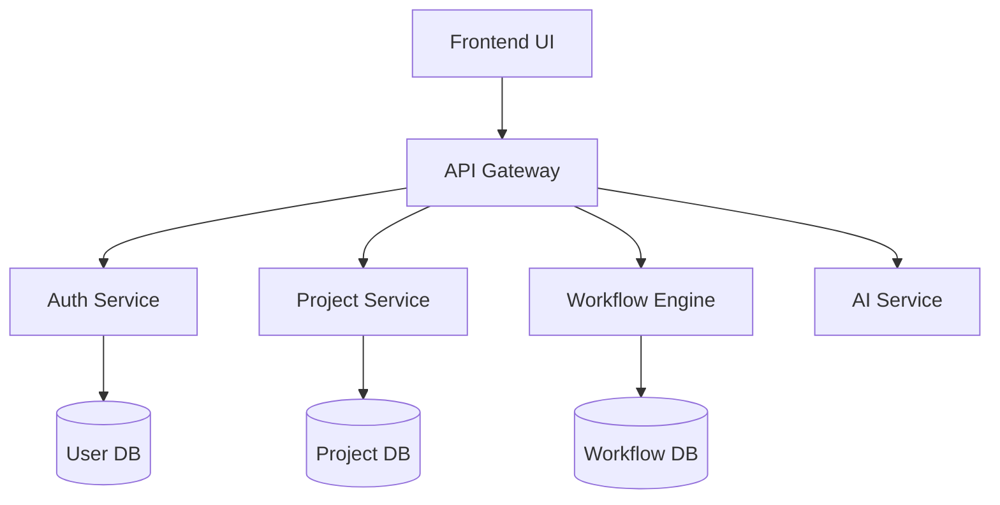

# NextScript Architecture Overview

## System Architecture

## Core Components

### 1. Frontend Layer
- React-based visual editor
- TailwindCSS for styling
- Real-time collaboration using WebSocket
- Component library with drag-and-drop interface
- State management with Redux Toolkit

### 2. API Gateway
- Express.js/Node.js based API gateway
- Request routing and load balancing
- Rate limiting and caching
- API authentication and authorization
- Request/response transformation

### 3. Microservices

#### Authentication Service
- JWT-based authentication
- OAuth2 integration
- Role-based access control (RBAC)
- Session management
- 2FA support

#### Project Service
- Project CRUD operations
- Version control integration
- Asset management
- Component registry
- Template management

#### Workflow Engine
- Visual workflow designer
- Business logic execution
- Event handling
- Integration connectors
- Custom action support

#### AI Service
- Code generation
- Intelligent suggestions
- Natural language processing
- Pattern recognition
- Automated testing

### 4. Data Layer

#### Databases
- PostgreSQL for relational data
- Redis for caching and real-time features
- MongoDB for document storage
- ElasticSearch for full-text search

#### Storage
- S3-compatible object storage
- CDN integration
- File versioning
- Asset optimization

## Security Architecture

### Authentication
- Multi-factor authentication
- SSO integration
- Session management
- Password policies

### Authorization
- Role-based access control
- Resource-level permissions
- API key management
- OAuth2/OpenID Connect

### Data Security
- End-to-end encryption
- Data at rest encryption
- Secure key management
- Audit logging

## Deployment Architecture

### Container Orchestration
- Kubernetes-based deployment
- Auto-scaling
- Health monitoring
- Rolling updates

### CI/CD Pipeline
- Automated testing
- Container building
- Deployment automation
- Environment management

## Integration Architecture

### External Systems
- REST API support
- GraphQL integration
- WebSocket support
- Message queues

### Plugin System
- Custom component development
- Third-party integrations
- Extension marketplace
- Versioning and updates

## Performance Considerations

### Scalability
- Horizontal scaling
- Load balancing
- Database sharding
- Caching strategies

### Monitoring
- Performance metrics
- Error tracking
- User analytics
- Resource utilization

## Development Workflow

### Local Development
- Docker-based development environment
- Hot reloading
- Debug tooling
- Test automation

### Deployment Process
- Environment promotion
- Feature flags
- Rollback procedures
- Blue-green deployments

## Future Considerations

### Planned Improvements
- Edge computing support
- AI/ML enhancements
- Mobile-first features
- Blockchain integration

### Scalability Roadmap
- Multi-region support
- Enhanced caching
- Performance optimizations
- Resource efficiency
